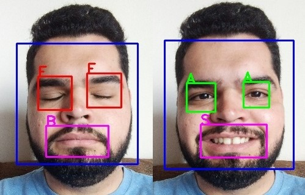
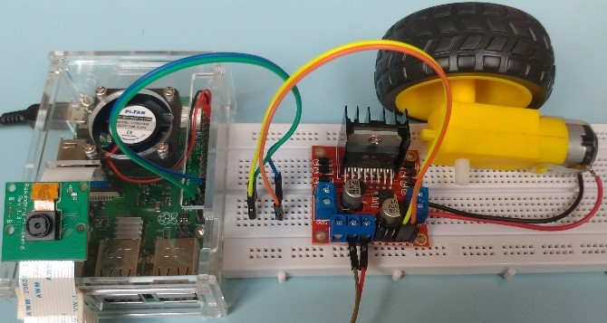
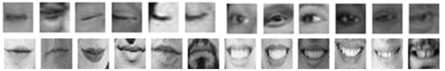

# Facial expression recognition with RaspBerry
Repository created with the purpose of sharing the codes developed during my course completion work (Computer Engineering) entitled "**Directional motor drive through facial expression recognition**".

## Objective
The objective of this research was to implement facial expression recognition using computer vision to control a direct current motor. As an initial evaluation prototype, it may in future be designed to assist on wheelchair’s control, for people who are unable to operate it in a conventional manner.

## Operation
To locate the regions of interest on the face, it was used the Viola-Jones algorithm, which allows real-time detection due to its low computational cost. To classify the expressions (eyes closed, smile), two convolutional neural network models were trained.

## Prototype
A prototype was assembled consisting of: 5MP mini camera for image acquisition; Raspberry Pi 3 B + for image processing and classification; L298N H-bridge module to assist in directional motor control and a direct current motor.

## Training

To classify the expressions (eyes closed, smile), two convolutional neural network models were trained, using 4800 images for the eye region and 1180 for the mouth. 

## Results

The algorithm proved to be efficient and very fast for detecting facial features and classifying expressions in real time. It presented an average of the right indices of 96,06%. 

